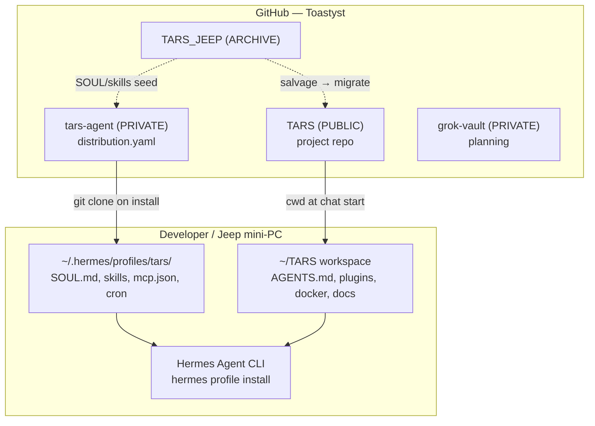
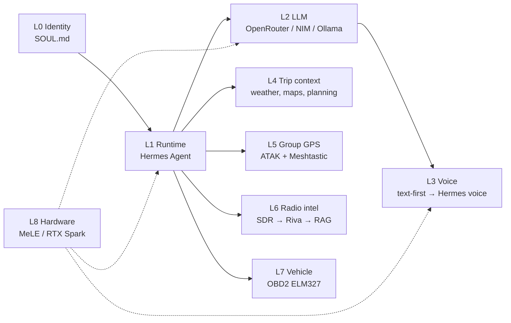
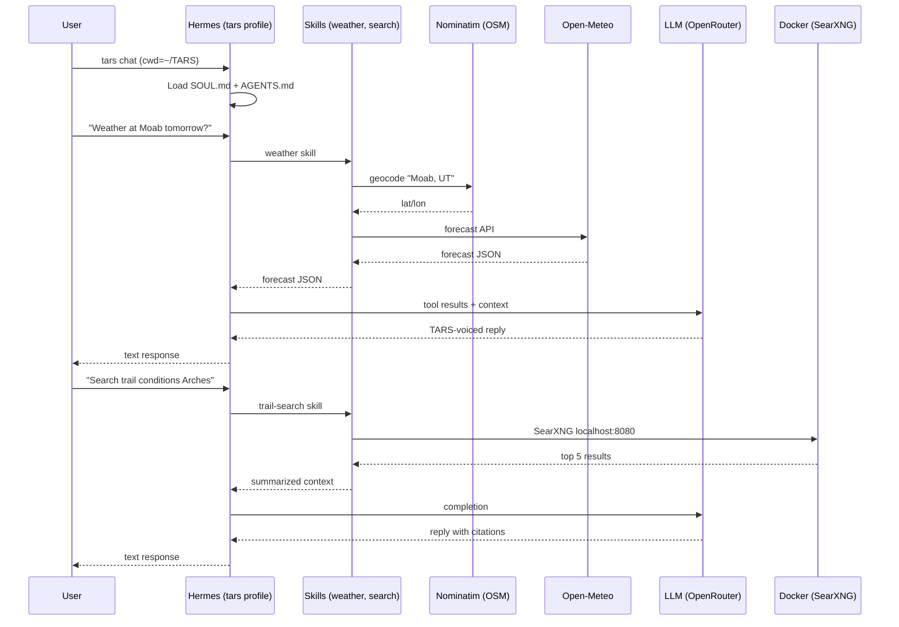
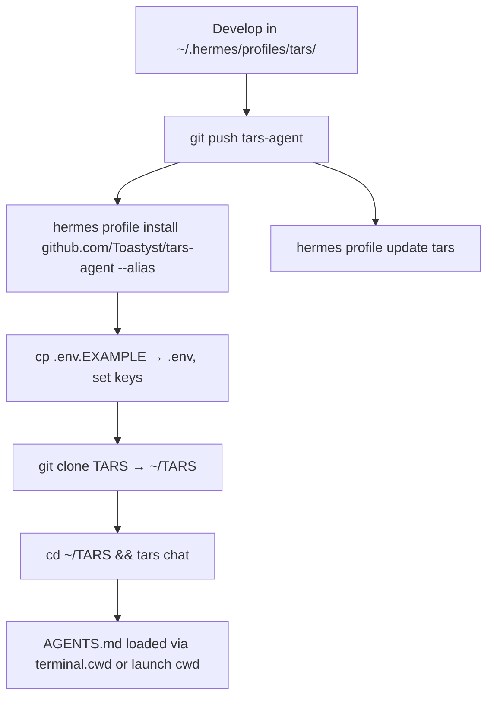
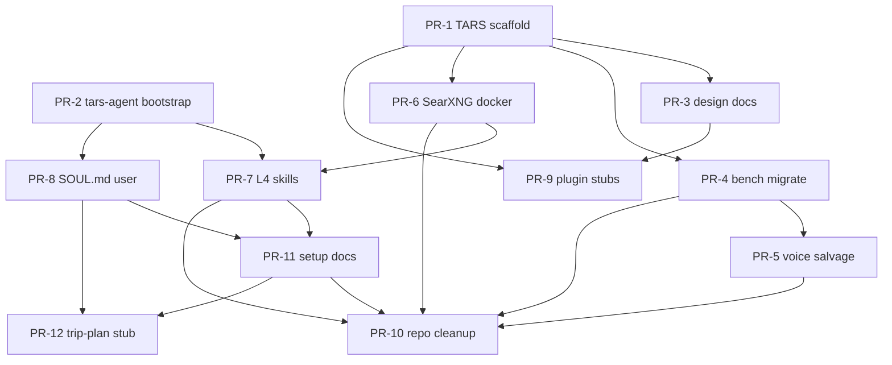

# TARS — Trail Assistance & Reasoning System
## Updated System Design — July 2026

| Field | Value |
|-------|-------|
| **Author** | Toastyst (design session) |
| **Status** | Revised — post-review Pass 2 (90cbc947); **implementation update July 2026** |
| **Date** | 2026-07-03 (design); **2026-07-04** (status refresh) |
| **Repos** | `Toastyst/TARS` (public, live), `Toastyst/tars-agent` (planned, deferred), `Toastyst/TARS_JEEP` (archive pending) |
| **Runtime** | [Hermes Agent](https://hermes-agent.nousresearch.com/) ≥ 0.12.0 |

---

## Overview

**TARS** (Trail Assistance & Reasoning System) is a voice-first, proactive AI companion for off-road trail and road-trip use in a Jeep Cherokee context. The north-star persona is movie TARS from *Interstellar* — witty, reliable, mission-focused — but the engineering goal is pragmatic: compose proven open-source layers into a dependable trailmate that keeps the driver and trail group informed, connected, and safe.

This document defines the **July 2026 system design**: migrate from ad-hoc prototypes (`tars_test_bench.py`, `TARS_JEEP`) to a **two-repo Hermes architecture** with a clear layer map (L0–L8), salvage plan, and phased rollout. Implementation follows design approval; no greenfield rewrite of the voice loop.

### Implementation status (July 2026)

| Area | Status | Notes |
|------|--------|-------|
| **TARS repo** (PR-1, PR-3) | **Done** | [Toastyst/TARS](https://github.com/Toastyst/TARS) — scaffold + `design/` on `main` |
| **tars-agent** (PR-2) | **Deferred** | Hermes profile install/bootstrap when time/budget allow |
| **Hermes smoke test** | **Deferred** | `hermes profile install` + `tars chat` not run yet |
| **GitHub hygiene — Pokemon cluster** | **Done** (early) | Duplicates deleted; [pokemon-agent](https://github.com/Toastyst/pokemon-agent) recreated flat (July 4 clean commit) |
| **GitHub hygiene — emote stub** | **Done** | `toast-emotes-portfolio` deleted; `twitch-emotes-portfolio` kept |
| **GitHub hygiene — TARS_JEEP** | **Pending** | Still live; archive **after** mandatory DB history purge |
| **GitHub hygiene — Arcane stubs** | **Partial** | `arcane-engine` (public) gone; `ArcaneEngine` (private) still active |
| **Bench / voice / SearXNG** (PR-4–6) | **Pending** | Local bench still at workspace root, not migrated |
| **L4 skills + SOUL.md** (PR-7–8) | **Pending** | Blocked on `tars-agent` bootstrap |

**Constraint (July 2026):** Limited time and API budget — Phase 0 focuses on repo hygiene and design truth; Hermes runtime work resumes when affordable.

---

## Background & Motivation

### Vision (documented in `grok-vault`, May 2026)

- OpenClaw-inspired **proactive agent** on a fixed mini-PC in the Jeep
- Voice-primary STT/TTS
- Meshtastic nodes for group GPS, stops, movement alerts
- GMRS radio integration
- OBD2 vehicle telemetry + proactive alerts (coolant, etc.)
- Maps, weather, offline trip planning
- Subagents for sensors / vision / radio
- MeLE fanless N100/N150 hardware (dust, 12V) — **deferred**
- Explicit: **no local KB/index rabbit hole** — TARS core first

### User notes (`tars-notes-7-3-26.txt`, planning session)

- Local as possible; APIs OK until reliable hardware arrives
- Realtime conversational STT/TTS (text OK for now on MacBook Boot Camp — mic unreliable)
- Self-extendable agent via Hermes skills
- NVIDIA Streaming Data → RAG blueprint for GMRS/CB radio intel (SDR → Riva ASR → context-aware RAG)
- **ATAK** (Android Team Awareness Kit) for group GPS — user confirmed
- User has GMRS and Meshtastic hardware already
- RTX Spark watch for future brain hardware

### Current code state

| Location | Contents | Issues |
|----------|----------|--------|
| `C:\TARS` (local) | `tars_test_bench.py` (157 lines), `requirements.txt`, `README.md` | No git; working Whisper + OpenRouter + pyttsx3 bench. **Also:** `mcps/`, `terminals/`, `.design/` (workspace tooling — **not** project files). README title is `# TARS_JEEP` and documents Ollama, but local bench uses OpenRouter (stale branding). |
| `Toastyst/TARS_JEEP` (GitHub) | Nested `TARS_JEEP/` zip artifact, `MACBOOKSERVER/TARS` Ollama assistant, docker open-webui + searxng `tars-tools` | `__pycache__`, committed open-webui DBs, nested layout, relative Ollama model paths / Windows batch fragility (`%~dp0`, dual `..\ollama` vs `.ollama` dirs — **not** `E:` drive paths per code review) |

### Bench variants (two copies — do not conflate)

| File | LLM backend | Status |
|------|-------------|--------|
| `C:\TARS\tars_test_bench.py` (local) | **OpenRouter** (`google/gemma-2-9b-it`) | **Canonical** — migrate in PR-4 |
| `TARS_JEEP/TARS_JEEP/tars_test_bench.py` (GitHub) | **Ollama** (`ollama.chat`) | Deprecated reference only — do not migrate |

**`tars_test_bench.py`** (local) is a monolithic proof-of-concept:

```12:21:C:\TARS\tars_test_bench.py
# === CONFIG - change these lines as needed ===
OPENROUTER_MODEL = "google/gemma-2-9b-it"  # see https://openrouter.ai/models
OPENROUTER_API_KEY = os.environ.get("OPENROUTER_API_KEY", "")
OPENROUTER_BASE_URL = "https://openrouter.ai/api/v1"
STT_SIZE     = "tiny"          # "tiny" = fastest, "base" = better accuracy
TTS_VOICE    = "David"         # Male voice suitable for TARS character
SYSTEM_PROMPT = "You are TARS, a witty and efficient AI companion from Interstellar. Respond helpfully and in character."
RECORD_SECONDS = 6
TTS_RATE = 180
LOG_FILE     = "tars_test_bench.log"
```

**TARS_JEEP** salvage targets:

- `MACBOOKSERVER/TARS/voice/` — modular STT/TTS pattern (`speech_to_text.py`, `text_to_speech.py`)
- `MACBOOKSERVER/tars-tools/` — SearXNG docker-compose + `searxng_pipeline.py`
- `MACBOOKSERVER/TARS/main.py` — console-mode flag (`--console`) for text-first dev

**Drop from TARS_JEEP:** `__pycache__`, `open-webui/data/*.db`, nested `TARS_JEEP/TARS_JEEP/` layout, relative Ollama/batch path fragility, committed vector DBs, `tars-tools` **pipelines** service (Open WebUI coupling), `TARS_JEEP/tars_test_bench.py` Ollama variant.

### Evaluated and rejected (for primary runtime)

| Option | Verdict |
|--------|---------|
| Rebuild on `tars_test_bench.py` | Rejected — no skills, MCP, cron, or profile distribution |
| OpenClaw as primary | Evaluated — Hermes chosen (user already productive with Hermes) |
| Workflow DevKit as voice runtime | Rejected |
| Local KB / RAG index (Phase 0) | Explicitly deferred — radio intel (L6) is the only planned RAG path |

---

## Goals & Non-Goals

### Goals

1. **Hermes-native runtime** — profile distribution (`tars-agent`) + project workspace (`TARS` repo with `AGENTS.md`)
2. **Text-first dev path** on MacBook Boot Camp; voice via Hermes voice layer when hardware allows
3. **User-owned persona** — `SOUL.md` written by user; no agent boilerplate in system prompt
4. **Salvage proven patterns** from TARS_JEEP without carrying technical debt
5. **Layer map clarity** — L0–L8 as composable capabilities, not a rigid timeline
6. **Repo hygiene** — clean GitHub footprint; archive stale repos
7. **First useful skills** — weather, maps/search, trip context (L4) before hardware layers

### Non-Goals (July 2026)

- MeLE N100/N150 Jeep install (L8) — deferred
- Full GMRS SDR → RAG pipeline (L6) — design stub only
- ATAK/Meshtastic live integration (L5) — plugin scaffold only
- OBD2 live telemetry (L7) — interface spec only
- Local embedding index / document KB
- Production voice latency tuning on Jeep hardware

---

## Proposed Design

### Architecture — two-repo Hermes model

Hermes separates **agent identity** (profile distribution) from **project context** (workspace repo). TARS follows this pattern exactly.



### Layer map (capability layers, not phases)



| Layer | Component | July 2026 target | Repo home |
|-------|-----------|------------------|-----------|
| **L0** | `SOUL.md` — persona, humor dial, mission tone | User-authored v0.1 | `tars-agent` |
| **L1** | Hermes Agent profile `tars` | Install + alias | `tars-agent` |
| **L2** | OpenRouter (dev), Ollama/NIM (later) | OpenRouter default | `tars-agent/config.yaml` |
| **L3** | Text chat; Hermes `tts:` block later (Phase 2) | Console/text primary | `tars-agent/config.yaml` (no `tts:` in v0.1); `TARS/tools/voice/` reference only |
| **L4** | Open-Meteo, OSM/Nominatim, SearXNG | **First skills shipped** | `tars-agent/skills/` + `TARS/docker/` |
| **L5** | ATAK + Meshtastic plugin ecosystem | Scaffold + docs | `TARS/plugins/group-gps/` |
| **L6** | NVIDIA RF→RAG for GMRS/CB | Design stub | `TARS/docs/radio-intel/` |
| **L7** | OBD2 via python-OBD / ELM327 | Interface spec | `TARS/plugins/vehicle/` |
| **L8** | MeLE N100, RTX Spark | Deferred | `TARS/docs/hardware/` |

### Runtime request flow (text mode, L4 enabled)



### Target repository layouts

#### `tars-agent` (private profile distribution)

```text
tars-agent/
├── .gitignore              # Hermes secrets template (see Hermes docs)
├── distribution.yaml
├── SOUL.md                   # USER-OWNED — placeholder until user writes v0.1
├── config.yaml               # model, provider, terminal.cwd, tool defaults
├── mcp.json                  # optional MCP servers (empty v0.1)
├── skills/
│   ├── weather/
│   │   ├── SKILL.md
│   │   └── scripts/geocode_and_forecast.py
│   ├── trail-search/
│   │   ├── SKILL.md
│   │   └── scripts/search.py
│   └── trip-plan/SKILL.md      # stub (post-v0.1)
├── cron/                     # empty v0.1; proactive alerts later
└── README.md
```

**`config.yaml` (draft — PR-2, Hermes-aligned):**

```yaml
# Hermes profile config for TARS (L1 + L2)
# Ref: cli-config.yaml.example (NousResearch/hermes-agent)
# Auth: OPENROUTER_API_KEY in .env (not in config.yaml)
# Post-install: run `hermes config check`

model:
  default: google/gemma-2-9b-it   # interim; see Open Question #1
  provider: openrouter
  base_url: https://openrouter.ai/api/v1

terminal:
  backend: local
  # Bind workspace so AGENTS.md loads predictably (not launch-dir dependent)
  cwd: "${TARS_WORKSPACE}"        # set in .env, e.g. C:\Users\Toastyst\TARS
  timeout: 180

providers:
  openrouter:
    request_timeout_seconds: 60   # Hermes provider timeout (not model.timeout_seconds)

platform_toolsets:
  # v0.1: CLI tools without tts (voice deferred to Phase 2)
  cli: [terminal, file, skills, todo]

# L3 voice (Phase 2): add `tts:` block per Hermes docs, or enable via `hermes tools`
# v0.1: omit tts — text chat only; no voice.enabled key (not in Hermes schema)
```

**`distribution.yaml` (draft — PR-2 bootstrap):**

```yaml
name: tars
version: 0.0.1                    # PR-7 bumps to 0.1.0; PR-12 bumps to 0.2.0
description: "Trail Assistance & Reasoning System — Hermes profile for Jeep trail companion"
hermes_requires: ">=0.12.0"
author: "Toastyst"
license: "UNLICENSED"

env_requires:
  - name: OPENROUTER_API_KEY
    description: "OpenRouter API key for LLM access"
    required: true
  - name: TARS_WORKSPACE
    description: "Absolute path to cloned TARS repo (for terminal.cwd / AGENTS.md)"
    required: true
  - name: OPEN_METEO_USER_AGENT
    description: "User-Agent for Open-Meteo and Nominatim (contact email)"
    required: false
    default: "TARS/0.1 (trail-companion)"
  - name: SEARXNG_BASE_URL
    description: "Local SearXNG endpoint"
    required: false
    default: "http://127.0.0.1:8080"
```

#### `TARS` (project workspace)

```text
TARS/
├── AGENTS.md                 # architecture, conventions, layer map
├── README.md
├── .gitignore
├── .env.example
├── docker/
│   └── searxng/
│       ├── docker-compose.yml
│       └── settings.yml
├── tools/
│   ├── voice/                # salvaged + modernized from TARS_JEEP
│   │   ├── speech_to_text.py
│   │   └── text_to_speech.py
│   └── bench/
│       └── tars_test_bench.py  # archived reference, not primary runtime
├── plugins/
│   ├── group-gps/            # L5 scaffold
│   │   └── README.md
│   └── vehicle/              # L7 scaffold
│       └── README.md
├── docs/
│   ├── architecture.md
│   ├── hardware.md           # L8 deferred
│   └── radio-intel/          # L6 NVIDIA pattern notes
└── design/                   # committed copies from workspace .design/ (PR-3)
```

**Path convention:** Workspace drafts live in `C:\TARS\.design\` (local, gitignored). The `TARS` repo commits to `design/` (no leading dot). PR-3 copies `.design/*.md` → `design/`.

### L3 voice integration (Phase 2 — no parallel voice loops)

| Phase | Path | Notes |
|-------|------|-------|
| v0.1 | Hermes text chat | Primary runtime; no standalone voice loop |
| v0.1 | `TARS/tools/bench/tars_test_bench.py` | Isolated STT/TTS experiments only |
| v0.1 | `TARS/tools/voice/` | Salvaged modules — reference for Hermes voice config tuning |
| Phase 2 | `config.yaml` `tts:` block (or `hermes tools`) | Hermes native faster-whisper + Edge TTS |
| Phase 2 | Deprecate bench loop | Bench retained for regression tests, not user-facing |

**Rule:** Do not maintain two production voice loops. Phase 2 enables Hermes voice; salvaged `tools/voice/` informs STT/TTS settings but is not invoked by the agent loop.

### Hermes deploy workflow



**Rules (non-negotiable):**

- Never commit `.env`, `auth.json`, `memories/`, `sessions/`, `state.db*`
- User writes `SOUL.md` before v0.1 tag — agent does not auto-generate persona prose
- **`terminal.cwd`** in `config.yaml` must point to the TARS workspace (via `TARS_WORKSPACE` env) so `AGENTS.md` loads even when chat is launched from another directory
- After `hermes profile install`, verify `SOUL.md` is the distribution placeholder — **not** Hermes default boilerplate (Hermes seeds a generic `SOUL.md` if missing; distribution install should overwrite it)
- `tars_test_bench.py` remains a **reference bench** in `TARS/tools/bench/`, not the production loop
- Profile updates replace distribution-owned files; user memories stay local
- **Git tags** (`v0.0.1`, `v0.1.0`) are for human/release tracking; Hermes `profile install` tracks default branch until git ref pinning ships — verify with `hermes profile info tars` after each `profile update`

### Salvage mapping (TARS_JEEP → new repos)

| Source (`TARS_JEEP`) | Destination | Action |
|----------------------|-------------|--------|
| `MACBOOKSERVER/TARS/voice/` | `TARS/tools/voice/` | Port; replace Google STT with faster-whisper pattern from **local** bench |
| `MACBOOKSERVER/TARS/main.py` `--console` | Hermes text chat | Pattern only — no Ollama loop |
| `MACBOOKSERVER/tars-tools/docker-compose.yml` (searxng only) | `TARS/docker/searxng/` | Salvage SearXNG service only; **edit** port bind to `127.0.0.1:8080:8080` (source uses `8080:8080` all interfaces) |
| `MACBOOKSERVER/tars-tools/pipelines` service | — | **Drop** — Open WebUI coupling; not salvaged |
| `MACBOOKSERVER/tars-tools/tools/searxng_pipeline.py` | `tars-agent/skills/trail-search/` | Rewrite as Hermes skill + `scripts/search.py`; drop `pipelines` package and `host.docker.internal` |
| `C:\TARS\tars_test_bench.py` (local OpenRouter) | `TARS/tools/bench/` | **Canonical** migrate; add deprecation header |
| `TARS_JEEP/TARS_JEEP/tars_test_bench.py` (Ollama) | — | **Drop** — deprecated duplicate |
| `open-webui/data/*` | — | **Delete** |
| `__pycache__/` | — | **Delete** |

### GitHub repo cleanup plan (verified inventory — PR-10)

Status refresh **2026-07-04**. Pokemon cluster and emote stub cleaned early (outside strict PR-10 gate). TARS-specific archive steps remain.

| Repo | Visibility | Action | Status (Jul 2026) | Canonical replacement / notes |
|------|------------|--------|-----------------|----------------------------|
| **CREATE** `tars-agent` | Private | Create | **Deferred** | Hermes profile distribution — when Hermes bootstrap resumes |
| **CREATE** `TARS` | **Public** (KD-11) | Create | **Done** | [Toastyst/TARS](https://github.com/Toastyst/TARS) — scaffold + design |
| **ARCHIVE** `TARS_JEEP` | Public | Archive **after mandatory DB history purge** | **Pending** | Redirect README → `TARS` + `tars-agent` |
| **DELETE** `toast-emotes-portfolio` | Public | Delete | **Done** | Canonical emote site is `twitch-emotes-portfolio` |
| **KEEP** `twitch-emotes-portfolio` | Public | Keep | **Done** | HTML emote portfolio site |
| **ARCHIVE** `arcane-engine` | Public | Archive | **Done** | Repo removed / no longer listed |
| **ARCHIVE** `ArcaneEngine` | Private | Archive | **Pending** | Unused private stub still exists |
| **KEEP** `pokemon-agent` | Public | Keep (clean) | **Done** | Recreated flat July 4 (`Initial clean commit`); no submodule junk |
| **DELETE** `pokemon-standalone-agent` | Private | Delete | **Done** | Merged then removed |
| **DELETE** `pokemon-agent-fork` | Private | Delete | **Done** | Merged then removed |
| **DELETE** `Toasts-Pokemon-Agent` | Public | Delete | **Done** | Superseded by clean `pokemon-agent` |
| **KEEP** `grok-vault` | Private | Keep | **Done** | Planning source |
| **KEEP** HelloKnight, portfolios, SpaghettiStories | — | Keep | **Done** | Unrelated active projects |

**Pokemon cleanup note:** Messy layout was caused by `git init` at `/home/toast/projects/` (parent workspace). Fix was delete + fresh repo with flat root — git history intentionally discarded. See `pokemon-agent` July 4 commit. **Prevention:** always `pwd` inside project root before `git push`.

**TARS_JEEP archive prerequisite (mandatory):** `webui.db` (~1.5 MB) and `chroma.sqlite3` exist in git history. Archiving without purge **still exposes** committed blobs. **Required** before archive: BFG Repo-Cleaner or `git filter-repo` to remove `*.db`, `*.sqlite3`, `__pycache__/`, then force-push; **or** replace with a fresh repo containing only redirect README + license (no history import).

---

## API / Interface Changes

### Hermes CLI (primary interface)

| Command | Purpose |
|---------|---------|
| `hermes profile create tars` | Local bootstrap before git push |
| `hermes profile install github.com/Toastyst/tars-agent --alias` | Deploy profile |
| `tars chat` | Text-first interactive session (cwd = `TARS` repo) |
| `hermes profile update tars` | Pull new skills/SOUL |
| `hermes profile info tars` | Verify distribution version |

### Skill interfaces (L4 — v0.1)

#### `weather` skill

```
Input:  location (lat/lon or place name), optional horizon hours
Output: structured forecast (temp, precip, wind, alerts summary)
Flow:   place name → Nominatim geocode → lat/lon → Open-Meteo forecast
APIs:   https://nominatim.openstreetmap.org/search (geocode)
        https://api.open-meteo.com/v1/forecast
Script: skills/weather/scripts/geocode_and_forecast.py
```

**Geocoding (v0.1 — in PR-7, not deferred):** Open-Meteo requires coordinates. PR-7 includes minimal Nominatim geocoding before forecast fetch. Respect Nominatim usage policy: max 1 req/s, set `User-Agent` via `OPEN_METEO_USER_AGENT` env (shared identifier string).

#### `trail-search` skill

```
Input:  query string
Output: top N results [{title, url, snippet}] as JSON
Backend: SearXNG at ${SEARXNG_BASE_URL:-http://127.0.0.1:8080}
Script: skills/trail-search/scripts/search.py
```

**Implementation (replaces Open WebUI pipeline):** Standalone Python script using `requests` → SearXNG `/search?format=json`. No `pipelines` package, no inlet hooks, no `host.docker.internal`. SKILL.md instructs agent to run script via `terminal` tool. Timeout: 30s. Top 5 results. Windows default URL: `http://127.0.0.1:8080` (not `host.docker.internal`).

#### `trip-plan` skill (stub v0.1)

```
Input:  origin, destination, waypoints[]
Output: route summary, offline GPX export instructions (future)
API:    OSM Nominatim + OSRM (public or self-hosted later)
```

### Future plugin interfaces (stubs)

| Plugin | Protocol | Notes |
|--------|----------|-------|
| `group-gps` | ATAK CoT / Meshtastic MQTT | L5 — user has hardware |
| `vehicle` | OBD2 PID reads via ELM327 serial | L7 — proactive coolant alerts |
| `radio-intel` | SDR IQ → Riva ASR → embedding store | L6 — NVIDIA blueprint |

### Environment variables

| Variable | Required | Layer | Notes |
|----------|----------|-------|-------|
| `OPENROUTER_API_KEY` | Yes (dev) | L2 | Primary LLM |
| `TARS_WORKSPACE` | Yes | L1 | Absolute path for `terminal.cwd` / `AGENTS.md` |
| `OPEN_METEO_USER_AGENT` | Recommended | L4 | Nominatim + Open-Meteo User-Agent (1 req/s geocode limit) |
| `SEARXNG_BASE_URL` | Optional | L4 | Default `http://127.0.0.1:8080` |
| `OLLAMA_HOST` | Later | L2 | Jeep/local inference |
| `MESHTASTIC_NODE_ID` | Later | L5 | Group GPS |
| `ATAK_SERVER_URL` | Later | L5 | Team awareness |

---

## Data Model

### Hermes profile state (local, never committed)

```text
~/.hermes/profiles/tars/
├── state.db              # conversation state
├── memories/             # long-term memory (user data)
├── sessions/             # session history
├── .env                  # API keys
└── auth.json             # provider auth
```

### TARS project artifacts (git-tracked)

| Artifact | Format | Purpose |
|----------|--------|---------|
| `AGENTS.md` | Markdown | Project context for Hermes |
| `skills/*/SKILL.md` | Markdown + YAML frontmatter | Hermes skill definitions |
| `docker/searxng/settings.yml` | YAML | SearXNG config |
| `tools/voice/*.py` | Python | Reference voice modules |
| `docs/**/*.md` | Markdown | Layer stubs, hardware notes |

### Trip context cache (future, local only)

```yaml
# ~/.hermes/profiles/tars/local/trip-cache.yaml (not in distribution)
active_trip:
  id: "moab-2026-08"
  waypoints: []
  last_weather_fetch: "2026-08-15T10:00:00Z"
  trailmates: []          # L5 — ATAK/Meshtastic IDs
```

### Radio intel store (L6 — future)

Per NVIDIA Streaming Data → RAG pattern:

- **Ingest:** SDR audio chunks → Riva ASR transcripts
- **Store:** time-windowed embeddings (not a general document KB)
- **Query:** context-aware retrieval scoped to current trip + frequency band
- **Explicit non-goal:** indexing arbitrary local files

---

## Alternatives Considered

### 1. Monolithic `tars_test_bench.py` as production runtime

**Pros:** Already works; simple Whisper + OpenRouter + pyttsx3 loop.  
**Cons:** No skills, MCP, cron, profile distribution, or proactive behavior; duplicates Hermes investment.  
**Decision:** Keep as bench reference only.

### 2. OpenClaw as primary agent runtime

**Pros:** Strong proactive/agent patterns; aligns with May 2026 vision doc.  
**Cons:** User already productive with Hermes; migration cost; no profile distribution equivalent in current workflow.  
**Decision:** Rejected as primary; borrow proactive *patterns* via Hermes cron later.

### 3. Open WebUI + Ollama stack (TARS_JEEP MACBOOKSERVER)

**Pros:** Working docker compose; searxng pipeline proven.  
**Cons:** Committed DBs, nested layout, relative Ollama/batch path fragility, Open WebUI + pipelines coupling, not voice-first or Jeep-portable.  
**Decision:** Salvage SearXNG docker + search logic only; abandon Open WebUI shell and pipelines service.

### 4. Single combined repo (profile + project)

**Pros:** One clone, simpler mental model.  
**Cons:** Violates Hermes distribution model; mixes public project docs with private SOUL/skills; harder to share project without exposing persona.  
**Decision:** Two-repo split (`tars-agent` private, `TARS` public).

### 5. Local RAG / knowledge base (Phase 0)

**Pros:** Rich context for trails, manuals, radio chatter.  
**Cons:** Rabbit hole; delays core companion; user explicitly deferred.  
**Decision:** Deferred except L6 radio-specific streaming RAG.

---

## Security & Privacy

| Concern | Mitigation |
|---------|------------|
| API key leakage | `.gitignore` per Hermes template; `tars-agent` private; never commit `.env` |
| SOUL.md injection | User-authored only; Hermes scans context files for injection patterns |
| Location privacy | Trip/GPS data stays in `local/` profile namespace; not in distribution |
| SearXNG exposure | Bind to `127.0.0.1:8080:8080` only (source compose uses all interfaces — **must edit on salvage**); PR-6 acceptance: `docker port` / `netstat` confirms localhost-only |
| Radio monitoring (L6) | Legal compliance user responsibility; log retention limits TBD |
| OpenRouter data | Use models with acceptable data policies; document in README |
| TARS_JEEP DB purge | **Mandatory** before archive — BFG/`git filter-repo` to remove `*.db`, `*.sqlite3`, `__pycache__/` from history, or fresh redirect-only repo. Archive-with-history without purge still exposes committed DB blobs. |

---

## Observability

| Signal | Mechanism | Owner |
|--------|-----------|-------|
| Hermes tool/skill errors | `~/.hermes/profiles/tars/logs/`, `errors.log` | L1 |
| LLM latency / cost | OpenRouter dashboard; optional `cron` cost digest later | L2 |
| SearXNG health | Docker healthcheck + skill timeout handling | L4 |
| Voice bench diagnostics | `tars_test_bench.log` (bench only) | L3 |
| Vehicle alerts (future) | Structured log + optional Meshtastic push | L7 |
| Profile version drift | `hermes profile info tars` vs git tags (tags not auto-pinned by installer yet) | L1 |

**Logging conventions (TARS repo):**

- Python tools: `logging` module, JSON-optional later
- No PII in git-tracked logs
- Skill failures return user-visible TARS-voiced error strings, not stack traces

---

## Rollout Plan

### Phase 0 — Foundation (July 2026, weeks 1–2)

- [ ] User writes `SOUL.md` v0.1 (humor setting, trail context, boundaries)
- [ ] Create `tars-agent` private repo + `distribution.yaml` — **deferred**
- [x] Create `TARS` public repo + `AGENTS.md` — **done** (2026-07-03)
- [x] Approved system design committed to `TARS/design/` — **done** (PR-3)
- [x] GitHub hygiene: Pokemon cluster + `toast-emotes-portfolio` — **done** (2026-07-04, early)
- [ ] `hermes profile install` verified on MacBook Boot Camp — **deferred** (PR-2 smoke test)
- [ ] Text chat works with OpenRouter; `AGENTS.md` loads via `terminal.cwd` — **deferred**

### Phase 1 — Trip context (July–August 2026)

- [ ] Ship `weather` and `trail-search` skills
- [ ] Docker SearXNG compose in `TARS/docker/`
- [ ] Salvage voice modules to `TARS/tools/voice/` (reference)
- [ ] Archive `TARS_JEEP`

### Phase 2 — Voice & proactive (Q3 2026)

- [ ] Hermes voice integration (faster-whisper, Edge TTS)
- [ ] Cron: pre-trip weather digest
- [ ] Console → voice toggle on reliable mic hardware

### Phase 3 — Group & vehicle (Q4 2026+)

- [ ] L5 ATAK/Meshtastic plugin scaffold → integration
- [ ] L7 OBD2 read + coolant alert skill
- [ ] L6 radio intel prototype on RTX Spark / bench SDR

### Phase 4 — Jeep hardware (2027+)

- [ ] L8 MeLE N100 install, 12V power, dust enclosure
- [ ] Local Ollama/NIM inference
- [ ] Offline map tiles

---

## Open Questions

1. **Default OpenRouter model** — interim default `google/gemma-2-9b-it` (matches bench) in `config.yaml`; benchmark tool-calling model before v0.2.0.
2. **SearXNG on Windows Boot Camp** — Docker Desktop vs WSL2 backend; skills use `127.0.0.1:8080` (not `host.docker.internal`).
3. **ATAK integration shape** — direct CoT XML vs Meshtastic-only for v1?
4. **SOUL.md humor dial** — numeric setting (movie TARS) as structured frontmatter?
5. ~~**TARS repo visibility**~~ — **Resolved:** public (`KD-11`); private persona/skills remain in `tars-agent`.
6. ~~**Git history purge**~~ — **Resolved:** mandatory BFG/filter-repo before `TARS_JEEP` archive (`KD-10`, Security table).
7. **RTX Spark timeline** — does L8 brain replace MeLE or complement it?

---

## References

| Resource | Path / URL |
|----------|------------|
| Local test bench | `C:\TARS\tars_test_bench.py` |
| TARS_JEEP (GitHub) | `https://github.com/Toastyst/TARS_JEEP` |
| Hermes profile distributions | `https://hermes-agent.nousresearch.com/docs/user-guide/profile-distributions` |
| Hermes context files (AGENTS.md) | `https://hermes-agent.nousresearch.com/docs/user-guide/features/context-files` |
| Planning vault | `grok-vault` (private) |
| User notes | `tars-notes-7-3-26.txt` |
| Open-Meteo API | `https://open-meteo.com/en/docs` |
| NVIDIA Streaming Data → RAG | NVIDIA blueprint (GMRS/CB intel layer) |
| ATAK | Android Team Awareness Kit — group GPS |

---

## Key Decisions

| # | Decision | Rationale |
|---|----------|-----------|
| **KD-1** | **Hermes Agent** is the sole agent runtime (L1) | User already productive; profile distributions, skills, MCP, cron are first-class; avoids rebuilding orchestration. |
| **KD-2** | **Two-repo split**: `tars-agent` (private distribution) + `TARS` (project workspace) | Matches Hermes model: SOUL/skills ship via profile install; `AGENTS.md` loads via `terminal.cwd` or launch cwd. Keeps persona private, project shareable. |
| **KD-3** | **Text-first** on MacBook Boot Camp; voice deferred to Hermes voice layer | Mic unreliable on Boot Camp; `tars_test_bench.py` proves voice stack but is not production path. |
| **KD-4** | **User-owned SOUL.md** — no auto-generated persona in system prompt | Prevents agent boilerplate from polluting TARS character; user must author Phase 0 persona before v0.1 tag. Post-install: verify distribution placeholder overwrote any Hermes default seed. |
| **KD-5** | **L4 trip context first** (weather, search) before L5–L8 | Delivers immediate trail value without hardware dependencies; aligns with "TARS core first" and no KB rabbit hole. |
| **KD-6** | **Salvage TARS_JEEP**, do not evolve in place | Nested layout, committed DBs, relative Ollama/batch fragility, and Open WebUI pipelines coupling exceed migration cost of clean repos. |
| **KD-7** | **OpenRouter for L2** until Jeep hardware supports local NIM/Ollama | APIs acceptable per user notes; bench already uses OpenRouter. |
| **KD-8** | **ATAK for group GPS** (L5), Meshtastic as mesh transport | User confirmed ATAK; Meshtastic hardware already owned. |
| **KD-9** | **No general local RAG/KB** in Phase 0–1 | Explicit scope control; L6 radio intel is the only planned RAG path (NVIDIA pattern). |
| **KD-10** | **Archive TARS_JEEP** after migration + **mandatory** DB history purge | GitHub hygiene; archive-with-history still exposes `webui.db` / `chroma.sqlite3` blobs without BFG/filter-repo. |
| **KD-11** | **`TARS` repo is public**; `tars-agent` stays private | Public workspace docs/plugins/docker are shareable; persona (`SOUL.md`) and skills remain in private distribution. |

---

## Skill Implementation Appendix (PR-7)

### `skills/weather/scripts/geocode_and_forecast.py`

```python
# Pseudocode — implement in PR-7
# Usage: python geocode_and_forecast.py "Moab, UT" [--hours 48]
# Env: OPEN_METEO_USER_AGENT (required for Nominatim)

def geocode(place: str) -> tuple[float, float]:
    # GET nominatim.openstreetmap.org/search?q={place}&format=json&limit=1
    # Headers: User-Agent: {OPEN_METEO_USER_AGENT}
    # Rate limit: 1 request/second — sleep if needed
    ...

def forecast(lat: float, lon: float, hours: int = 48) -> dict:
    # GET api.open-meteo.com/v1/forecast?latitude=&longitude=&hourly=...
    ...

if __name__ == "__main__":
    # Print JSON to stdout for agent parsing
    ...
```

### `skills/trail-search/scripts/search.py`

```python
# Pseudocode — implement in PR-7
# Usage: python search.py "trail conditions Arches National Park"
# Env: SEARXNG_BASE_URL (default http://127.0.0.1:8080)

import os, requests, json, sys

BASE = os.environ.get("SEARXNG_BASE_URL", "http://127.0.0.1:8080")
TIMEOUT = 30
MAX_RESULTS = 5

def search(query: str) -> list[dict]:
    r = requests.get(f"{BASE}/search", params={"q": query, "format": "json"}, timeout=TIMEOUT)
    r.raise_for_status()
    return [{"title": x["title"], "url": x["url"], "snippet": (x.get("content") or "")[:300]}
            for x in r.json().get("results", [])[:MAX_RESULTS]]

if __name__ == "__main__":
    print(json.dumps(search(" ".join(sys.argv[1:]))))
```

**SKILL.md pattern (both skills):** Describe when to invoke → run script via Hermes `terminal` tool → parse JSON stdout → synthesize TARS-voiced reply. On failure: user-visible error string, no stack trace.

---

## PR Plan

Ordered pull requests for repo cleanup, Hermes bootstrap, and first skills. Dependencies noted — do not merge out of order within a chain.

---

### PR-1: `chore: initialize TARS project repo scaffold` — **DONE** (2026-07-03)

| Field | Value |
|-------|-------|
| **Repo** | `Toastyst/TARS` (new, **public** per KD-11) |
| **Depends on** | — |
| **Files** | `README.md` (Hermes-first; remove `# TARS_JEEP` branding), `.gitignore`, `AGENTS.md`, `.env.example`, `docs/architecture.md` |
| **Description** | Create public project repo with layer map in `AGENTS.md`, conventions, and empty plugin/doc stubs. **Do not** `git add .` from `C:\TARS` workspace root. Use explicit allow-list only. |

**Allow-list (only these files from local workspace):** none required at init — create scaffold files fresh. Do **not** copy `mcps/`, `terminals/`, `.design/`, `*.log`.

**`.gitignore` must include:** `mcps/`, `terminals/`, `.design/`, `*.log`, `.env`, `__pycache__/`, `node_modules/`.

**Acceptance:** `git status` shows only scaffold files; no MCP/tooling paths staged.

---

### PR-2: `feat(tars-agent): bootstrap Hermes profile distribution` — **DEFERRED**

| Field | Value |
|-------|-------|
| **Repo** | `Toastyst/tars-agent` (new, **private**) |
| **Depends on** | — (parallel with PR-1) |
| **Files** | `distribution.yaml`, `.gitignore`, `config.yaml` (see draft above), `mcp.json`, `README.md`, `SOUL.md` (placeholder stub) |
| **Description** | Private Hermes distribution skeleton. `config.yaml` uses Hermes schema: `model.provider`/`model.default`, `terminal.cwd` via `${TARS_WORKSPACE}`, `platform_toolsets.cli` (no `tts` in v0.1), `providers.openrouter.request_timeout_seconds`. `distribution.yaml` version `0.0.1`. `SOUL.md` contains only `# TARS — user must author` (overwrites Hermes default on install). Tag `v0.0.1` after merge (human tracking; installer tracks default branch). Run `hermes config check` after install. |

**Acceptance (smoke test — L-4):**
1. `hermes profile install github.com/Toastyst/tars-agent --alias`
2. Set `.env`: `OPENROUTER_API_KEY`, `TARS_WORKSPACE=<absolute TARS path>`
3. `hermes config check` — no missing required options
4. `tars chat` — text-only reply works **before** L4 skills land
5. `hermes profile info tars` shows distribution `tars@0.0.1` (matches `distribution.yaml` version)
6. Verify `SOUL.md` is placeholder, not Hermes generic seed

---

### PR-3: `docs: add approved system design to TARS/design` — **DONE** (2026-07-03)

| Field | Value |
|-------|-------|
| **Repo** | `Toastyst/TARS` |
| **Depends on** | PR-1 |
| **Files** | `design/TARS-DESIGN.md`, `design/TARS-DESIGN-SUMMARY.md` |
| **Description** | Committed canonical copy at `design/` (workspace `.design/` remains gitignored). This status refresh (2026-07-04) updates implementation progress in the same files. |

---

### PR-4: `feat: migrate tars_test_bench to tools/bench`

| Field | Value |
|-------|-------|
| **Repo** | `Toastyst/TARS` |
| **Depends on** | PR-1 |
| **Files** | `tools/bench/tars_test_bench.py`, `tools/bench/requirements.txt`, `README.md` (update) |
| **Description** | Migrate **local** `C:\TARS\tars_test_bench.py` (OpenRouter canonical) to `tools/bench/`. Add header: reference only, not production runtime. **Do not** migrate `TARS_JEEP/TARS_JEEP/tars_test_bench.py` (Ollama variant). Rewrite root `README.md` for Hermes-first workflow; remove `# TARS_JEEP` branding and stale Ollama docs. |

---

### PR-5: `feat: salvage voice module from TARS_JEEP`

| Field | Value |
|-------|-------|
| **Repo** | `Toastyst/TARS` |
| **Depends on** | PR-4 |
| **Files** | `tools/voice/__init__.py`, `tools/voice/speech_to_text.py`, `tools/voice/text_to_speech.py`, `tools/voice/config.py`, `tools/voice/README.md` |
| **Description** | Port modular voice pattern from `TARS_JEEP/MACBOOKSERVER/TARS/voice/`. Replace Google STT with faster-whisper interface matching bench. Add `--console` usage notes for future Hermes voice bridge. No Ollama dependency. |

---

### PR-6: `feat(docker): add SearXNG compose from tars-tools`

| Field | Value |
|-------|-------|
| **Repo** | `Toastyst/TARS` |
| **Depends on** | PR-1 |
| **Files** | `docker/searxng/docker-compose.yml`, `docker/searxng/settings.yml`, `docker/searxng/README.md` |
| **Description** | Salvage **SearXNG service only** from `TARS_JEEP/MACBOOKSERVER/tars-tools/` — **drop** `pipelines` service. **Edit** port mapping from source `"8080:8080"` to `"127.0.0.1:8080:8080"`. Document Windows Docker Desktop startup. |

**Acceptance:** `docker compose up` → `docker port` / `netstat` confirms SearXNG bound to localhost only, not `0.0.0.0`.

---

### PR-7: `feat(skills): add weather and trail-search Hermes skills`

| Field | Value |
|-------|-------|
| **Repo** | `Toastyst/tars-agent` |
| **Depends on** | PR-2, PR-6 |
| **Files** | `skills/weather/SKILL.md`, `skills/weather/scripts/geocode_and_forecast.py`, `skills/trail-search/SKILL.md`, `skills/trail-search/scripts/search.py`, `distribution.yaml` (bump to `0.1.0`) |
| **Description** | Implement L4 skills per Skill Implementation Appendix. `weather`: Nominatim geocode → Open-Meteo forecast (place names supported in v0.1). `trail-search`: `search.py` via `requests` → `${SEARXNG_BASE_URL}` JSON API; no Open WebUI pipeline. Tag `v0.1.0`; run `hermes profile update tars` + `hermes profile info tars` to verify. |

---

### PR-8: `feat(soul): user-authored SOUL.md v0.1`

| Field | Value |
|-------|-------|
| **Repo** | `Toastyst/tars-agent` |
| **Depends on** | PR-2 |
| **Files** | `SOUL.md` |
| **Description** | **User PR** — replace placeholder with authored persona (humor dial, trail context, response length, safety boundaries). No agent framework boilerplate. Required before calling profile production-ready. |

---

### PR-9: `feat(plugins): scaffold L5 group-gps and L7 vehicle stubs`

| Field | Value |
|-------|-------|
| **Repo** | `Toastyst/TARS` |
| **Depends on** | PR-3 |
| **Files** | `plugins/group-gps/README.md`, `plugins/vehicle/README.md`, `docs/radio-intel/README.md`, `docs/hardware.md` |
| **Description** | Document ATAK + Meshtastic integration plan (L5), OBD2 ELM327 interface (L7), NVIDIA radio RAG pattern (L6), deferred MeLE/RTX Spark (L8). No implementation — design stubs only. |

---

### PR-10: `chore: GitHub repo cleanup — delete and archive` — **PARTIAL** (2026-07-04)

| Field | Value |
|-------|-------|
| **Repo** | GitHub org/user settings + `TARS_JEEP` |
| **Depends on** | ~~PR-4–7, PR-11~~ for Pokemon/emote items (completed early); **TARS_JEEP** still requires purge + optional PR-11 |
| **Files** | `TARS_JEEP/README.md` (archive notice only) |
| **Description** | Execute verified inventory table (GitHub repo cleanup plan). |

**Completed (Jul 2026):** `toast-emotes-portfolio` deleted; Pokemon duplicates deleted; `pokemon-agent` recreated clean; `arcane-engine` (public) removed.

**Remaining:** **Mandatory** BFG/`git filter-repo` on `TARS_JEEP` before archive; archive `ArcaneEngine` (private); redirect README on `TARS_JEEP` → `Toastyst/TARS` + `Toastyst/tars-agent`. PR-11 setup docs recommended before `TARS_JEEP` archive but no longer blocks non-TARS cleanup. |

---

### PR-11: `docs: Hermes install and dev workflow`

| Field | Value |
|-------|-------|
| **Repo** | `Toastyst/TARS` |
| **Depends on** | PR-7, PR-8 |
| **Files** | `docs/hermes-setup.md`, `README.md` |
| **Description** | End-to-end setup guide. Include: `hermes profile install`, env file mapping table (`tars-agent/.env` vs `TARS/.env.example`), `TARS_WORKSPACE` for `terminal.cwd`, SearXNG docker, `tars chat` verification. |

**Env file mapping (L-2):**

| File | Repo | Keys |
|------|------|------|
| `.env` (from `.env.EXAMPLE`) | `tars-agent` profile dir | `OPENROUTER_API_KEY`, `TARS_WORKSPACE`, `OPEN_METEO_USER_AGENT`, `SEARXNG_BASE_URL` |
| `.env.example` | `TARS` | `SEARXNG_BASE_URL`, `TARS_WORKSPACE` (for docker/scripts reference) |

**Checklist items:** post-install `SOUL.md` verification; `hermes profile info tars` version check; `AGENTS.md` loaded from `TARS_WORKSPACE`; skills smoke test (weather + trail-search).

---

### PR-12: `feat(skills): trip-plan stub and cron placeholder` *(post-v0.1 enhancement)*

| Field | Value |
|-------|-------|
| **Repo** | `Toastyst/tars-agent` |
| **Depends on** | PR-7, PR-8, PR-11 (v0.1 gate complete) |
| **Files** | `skills/trip-plan/SKILL.md`, `cron/README.md`, `distribution.yaml` (bump to `0.2.0`) |
| **Description** | **Post-v0.1** — not on critical path. Stub trip-plan skill (route planning beyond geocode). Document future cron jobs (pre-trip weather, coolant check) without enabling them. Tag `v0.2.0` after v0.1 production-ready declaration. |

---

### PR dependency graph



**Total PRs: 12**

**Critical path:** PR-1 → PR-2 (smoke test) → PR-6 → PR-7 → PR-8 → PR-11 → tag **v0.1.0** (first usable TARS chat with skills + persona)

**Progress (Jul 2026):** PR-1 ✅ PR-3 ✅ PR-10 partial ✅ — **next when resuming:** PR-2 (`tars-agent` bootstrap).

**User gate:** PR-8 (SOUL.md) must be authored by user before declaring v0.1 production-ready.

**Post-v0.1:** PR-12 (trip-plan stub, v0.2.0) — after PR-11 merge and v0.1 tag.